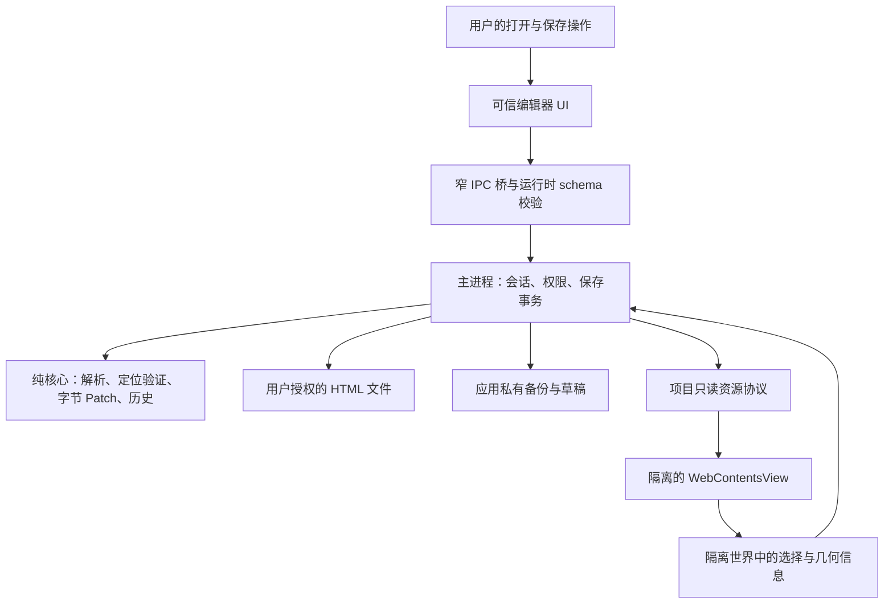

# 技术架构

状态：产品架构设计基线；HAE-001 至 HAE-004 已验证工具链、隔离预览、静态树与纯字节候选。HAE-005 自动实验已组成统一 Main 窗口会话，连接草稿、输入、可信 IPC、另存、文档/视图及关闭；HAE-008 增加目录授权、入口切换和资源诊断；HAE-010 增加显式覆盖保存与新基线接线。正常应用入口、产品面板、撤销历史和恢复流程仍待实现。版本、执行范围和未测项见 [开发说明](docs/DEVELOPMENT.md)、[HAE-005](docs/implementation/HAE-005.md)、[HAE-008](docs/implementation/HAE-008.md) 与 [HAE-010](docs/implementation/HAE-010.md)。

## 1. 技术选型

| 层 | 选择 | 理由与边界 |
| --- | --- | --- |
| 桌面宿主 | Electron，实施时选仍受支持的稳定版本 | 自带 Chromium，Windows/macOS 共用渲染核心；承担体积和更新成本 |
| 编辑器 UI | React + TypeScript strict | UI 状态明确，减少草稿、保存和异步响应错配 |
| UI 基础组件 | 优先 Radix 无样式可访问组件，视觉方案后再定样式 | 不把主题库、重型编辑器或整站模板作为前置依赖 |
| 构建 | Vite 8.2.2 独立入口；Forge 打包延后 | 主进程、两个 preload、UI/Preview 分别构建；安装器仍在 HAE-015 |
| HTML 解析 | parse5，开启 sourceCodeLocationInfo | 获得源码位置，不使用 serializer 保存整份文档 |
| 修改引擎 | 自研纯 TypeScript 的字节范围替换 | 核心不依赖 DOM、Electron 或操作系统判断 |
| 会话模型 | 显式 reducer / 状态机 + 版本化 IPC 数据结构 | 先采用最小状态管理，不同时引入多个状态库 |
| 文件与持久化 | Main 中封装 Node fs，JSON 日志 + 原始备份 | 单文件事务；首版不引入数据库 |
| 验证 | 纯核心测试 + Electron 集成/E2E + 人工实机 | E2E 驱动候选 Playwright Electron API，M1 验证适配性 |

Electron 的平台与版本支持参照 [官方仓库](https://github.com/electron/electron#platform-support) 和 [发布政策](https://www.electronjs.org/docs/latest/tutorial/electron-timelines)。版本号不在计划中凭空固定；实施 PR 必须记录 Electron、Chromium、Node、包管理器版本与锁文件，两个系统使用同一核心依赖版本。

parse5 能提供源码位置，但解析器隐式创建的元素可能没有位置，位置下标也不是可直接用于 UTF-8 Buffer 的字节偏移。[ParserOptions](https://parse5.js.org/interfaces/parse5.ParserOptions.html)、[Location](https://parse5.js.org/interfaces/parse5.Token.Location.html)。字节映射是本项目必须额外实现和验证的逻辑。

## 2. 进程与信任边界

可信 UI 在 `BrowserWindow` 中运行；用户 HTML 由独立 `WebContentsView` 承载，不能加载编辑器页面、配置、备份或本地任意文件。UI 和 Preview 使用不同 session 与不同协议源。生命周期、销毁和尺寸由 Main 管理。[WebContentsView 官方 API](https://www.electronjs.org/docs/latest/api/web-contents-view)。

### 预览安全基线

- `nodeIntegration: false`、`contextIsolation: true`、`sandbox: true`、`webSecurity: true`；禁用 webviewTag、实验特性和不安全混合内容。
- Preview preload 只在隔离世界维护选择注册表与发回有限信息；不向页面主世界暴露文件、保存、Shell 或原始 `ipcRenderer`。
- Main 校验 sender 的 webContents、senderFrame、项目会话、源、会话世代和 payload；页面传来的路径、offset、旧值和选择器都不能成为写盘授权。
- Preview 与任何子 frame 均不得直接发起保存。只有可信 UI 的显式操作可请求 Main 保存其已验证的草稿集合。
- 默认拒绝权限请求、下载、新窗口、外部导航、弹窗和设备访问；不自动调用系统浏览器或外部协议。
- UI 使用严格 CSP。Preview 保留原页 CSP；校稿模式关闭脚本，交互模式仅执行被离线资源策略允许的本地脚本。不得通过关闭 webSecurity 或绕过 CSP 恢复兼容性。

上述边界参考 [Electron 安全指南](https://www.electronjs.org/docs/latest/tutorial/security)；应用级协议、来源校验和模式切换规则是本项目设计，仍须以负向测试验证。

### 自定义协议与目录授权

采用 `artifact://<session-id>/<relative-path>` 作为预览资源入口，`editor://app/` 作为可信 UI 源。随机 session-id 只用于隔离和定位，不是唯一权限证明。处理器只能使用 Main 内登记的根目录与允许入口。

协议在对应 session 上注册。`standard`、`secure`、Fetch 支持等能力按 CSS、模块脚本、本地资源测试的最小需要启用；不启用 bypassCSP 和 Service Worker。注册时机及 session 规则参考 [protocol API](https://www.electronjs.org/docs/latest/api/protocol)。

项目路径处理必须拒绝 NUL、遍历路径、编码后的穿越、UNC/设备路径、Windows ADS 和越界符号链接/junction。解码后规范化并核验 realpath 位于根内，读取时验证实际目标身份，防止检查后链接被替换。只按资源请求读取，不提供列目录、任意磁盘路径读取或任何写接口。以路径分隔符边界判断，不能仅用字符串前缀。

根目录内的本地页面脚本可能读取该根中的可服务资源，因此打开文件时需说明授权根范围，建议采用独立项目文件夹。`.git`、应用状态、备份、凭据文件、隐藏配置以及非预览用途的文件类型不在可服务清单；同根可服务资源仍不应放入秘密。初期对白名单资源类型建立用例，新增类型需评估读取范围。

HTTP(S)、WebSocket、远程字体、在线 API、`file://`、外部协议、表单提交和导航在预览网络层默认拒绝。`data:` 图片等内存资源按 MIME 限制；`blob:` 不得获得磁盘或网络扩权。`<base>` 解析后仍执行相同根边界。不得把 localhost 或局域网地址当成离线可信资源。

单文件打开默认根为所在文件夹；用户通过可信文件对话框才能选择更大的根。切换项目撤销旧会话所有资源与 IPC 能力。内存 session 不复用其他项目的 Cookie、缓存或存储。

## 3. 模块边界与未来目录

HAE-001 已创建各顶层模块和内置验证壳；下表的业务子模块仍是后续任务目标。

| 目录 | 职责 | 禁止依赖 |
| --- | --- | --- |
| `src/core/parser/` | UTF-8 解码、源码索引和位置映射 | Electron、DOM、文件系统 |
| `src/core/patch/` | 补丁前置检查、编码、Buffer 结果计算 | UI、OS 分支、网络 |
| `src/core/history/` | 操作组、保存点、撤销重做 | 直接磁盘写入 |
| `src/contracts/` | schema、错误码、DTO、协议版本 | 平台和 UI 具体实现 |
| `src/main/projects/` | 文件选择、授权、会话生命周期 | 来自 Preview 的任意路径授权 |
| `src/main/storage/` | 备份、事务、锁、恢复、清理 | 页面脚本执行 |
| `src/main/protocol/` | 项目资源与离线请求策略 | 通用 HTTP 代理、任意路径服务器 |
| `src/preload/` | 可信 UI 桥、预览隔离世界观察器，分别构建 | 共享给页面的高权限 API |
| `src/preview/` | 命中测试、几何、节点注册与只读原因 | 自行决定写入 offset |
| `src/ui/` | 工具栏、画布周边、草稿、Diff、错误恢复 | Node fs、原始 IPC |
| `src/platform/` | 菜单、快捷键、窗口、对话框平台差异 | 分叉核心 Patch 算法 |
| `tests/fixtures/` | 自制或有许可的正常/恶意/崩溃样例 | 用户原始业务文件 |

先采用一个包、一个锁文件；等真实依赖边界需要时再拆 monorepo。大型库、数据库、插件系统、自动更新均不是 MVP 前提。

## 4. 核心数据流

1. Main 通过原生对话框取得入口和项目根，生成 projectId、documentId、generation。
2. Main 读取原始 Buffer，校验 UTF-8、大小、文件身份和 hash；只读构建 SourceSnapshot。
3. Core 解析并创建可支持静态 Text 范围索引。超过大小/复杂度预算时取消并给出只读原因。
4. 校稿 Preview 加载同一快照内容，脚本禁用；DOM 与 parse5 的映射必须通过 HAE-003。交互 Preview 可运行本地 JS，但首版不接受其内容写回。
5. 选择器发送 nodeId 和选择世代等有限信息；Main 用自己的索引校验 nodeId。CSS selector 仅作 UI 提示。
6. 可信 UI 编辑纯文本草稿。应用草稿只更新受控预览文本和历史，不写 HTML。
7. 可信 UI 保存时，Main 串行化该文件事务，复核基线、备份、生成字节结果、替换并回读验证。
8. 成功后重新解析新基线，重新创建 nodeId；历史逻辑保留，旧选择和旧 offset 全部失效。

完整补丁格式、重基线、写盘故障和崩溃恢复见 [Patch 规范](docs/PATCH_SPEC.md)。

## 5. 并发、状态与错误

每个项目持有一份 Main 权威状态：`empty / loading / clean / editing / dirty / saving / conflict / error / closing`。草稿输入另有 `composing` 标记。每个异步响应携带 projectId、documentId、generation、requestId；过期响应被忽略，不能切回旧项目或误标“已保存”。

每个文件只允许一个保存事务；保存时冻结提交快照并暂时禁止新编辑，页面仍可滚动。外部监听只是提示，保存前必须重新读取和校验磁盘。应用内多窗口/多进程写入需协调锁；对不合作的外部写入者仍有文件系统竞态，不能把 read-hash-rename 宣称为完整 CAS。

大文档解析与 Diff 计算应放入有资源上限、可超时终止的工作线程，避免阻塞主进程；只传入冻结字节与纯核心参数，不执行页面脚本。工作线程用于计算隔离和取消，不等同于浏览器权限沙箱。预览无响应时 Main 能销毁该 WebContentsView 并保留编辑草稿。

结构化错误码至少包含 `UNSUPPORTED_ENCODING`、`UNMAPPABLE_NODE`、`STALE_SELECTION`、`FILE_CHANGED`、`BACKUP_FAILED`、`WRITE_FAILED`、`SAVE_OUTCOME_UNKNOWN`、`RESOURCE_BLOCKED`。面向用户的短提示和动作见交互文档；日志默认不包含完整页面文字或绝对路径。

## 6. 验证和待决策项

优先验证三个问题：源码映射准确性、未改字节不变、预览无越权通道。它们不通过时先收缩支持范围，不继续扩展 UI 能力。

WebContentsView 是独立原生视图，可能覆盖 BrowserWindow 内的 DOM 弹层。选区编辑控件默认放在可信侧栏；原位编辑浮层作为候选，必须验证跨 DPI、滚动、缩放、窗口尺寸、IME 候选框和可访问性。不可为实现浮层把文件能力暴露给 Preview。

React/TypeScript/Vite 版本已在 HAE-001 锁定，使用 Node 自带测试运行器与独立 Electron 冒烟入口。HAE-003 锁定 parse5 并验证静态映射；Radix、Forge、产品 E2E 驱动与跨平台替换仍待对应任务验证。

### HAE-001 验证壳的具体边界

`npm run dev` 保留构建时自带的验证壳，通过各 session 内的精确 URL → 内存内容映射返回资源。`editor://app/` 与随机 `artifact://…/` 分离。该默认入口只安装只读启动服务，后续编辑/目录 preload 方法没有对应 Main handler；Preview 页面没有桥，preload 报告启动诊断，Main 校验 sender、session、主 frame、完整源 URL 和 payload，收到后撤销该监听器。

Electron 44.2.0 本地实验中 `javascript: false` 阻止了 Preview preload 初始化。因此保留隔离 preload 所需的引擎，使用响应头 `script-src 'none'` 禁止校稿页脚本；不启用 bypassCSP，沙箱、上下文隔离和 webSecurity 全部开启。HAE-002 已验证原 CSP 叠加、脚本入口与子 frame 拒绝；HAE-003 采用 scriptingEnabled=true 并通过 noscript 对照，不能把 CSP 禁止执行等同于解析器 scriptingEnabled=false。

### HAE-002 项目预览的实施边界

- Main 原生选择器只授予所选 HTML 的父目录，项目 protocol 只注册在新的内存 session 中。入口为固定 UTF-8 原始字节快照，资源按请求只读；请求解码一次，拒绝私有路径、非白名单类型、符号链接/junction、硬链接与 Windows 路径别名。读取前后的路径链、realpath 与打开句柄的 dev/ino、大小和时间戳必须一致。
- 校稿以 CSP 禁用全部页面脚本；交互允许本地 classic/module/inline 脚本，不允许 eval。两者都没有选区写回或保存 API。原始 HTML 不删 CSP、不插入标记、不做整页序列化。
- 网络层拒绝非当前 artifact 域的请求，并将 session 设为 offline；权限、外部导航、弹窗、下载、frame、worker、data/blob 资源均拒绝。资源兼容白名单和大小/并发上限见开发说明；这是有意收缩的初始范围。
- WebRTC 不完全受 URL 请求过滤控制。Main 在可信空白页启动后、加载用户字节前，通过 [Electron Debugger](https://www.electronjs.org/docs/latest/api/debugger) 和 [CDP Page](https://chromedevtools.github.io/devtools-protocol/tot/Page/) 的文档创建钩子，在所有 frame 中不可重定义地关闭 WebRTC/WebTransport、文件选择 API 和打印，拦截文件拖放，并取消 HTML 文件输入的原生选择器。该钩子没有页面桥，不开放命令给页面；未设置 bypassCSP。保护安装失败或调试连接意外断开会撤销资源并关闭预览，正常销毁先撤销以避免重入。相关 API 依赖锁定 Electron/Chromium，升级时必须重跑负向用例。
- `PreviewController` 只接受 Main 路径与模式。成功切换先替换权威引用并同步撤销旧权限，销毁旧 WebContents 和清空存储；失败保留旧预览，过期/取消请求不可回填。IPC 目前仅有严格的只读启动确认，Main 验证 contents、session、senderFrame、源 URL、世代、模式和 schema。

路径与句柄复核覆盖已执行的文件替换、junction 替换和读中写入用例，不能冒称为所有文件系统上的内核原子授权或抵御拥有同等 OS 权限的敌对本地进程。网络盘、云同步、Mac 文件系统与更多竞态语料尚未验收；不因此开放任何写入。

### HAE-003 静态源码映射

纯核心复制并严格解码 UTF-8，生成含 BOM 修正的 UTF-16→字节边界索引，再由 parse5 8.0.1 生成规范化整树与连续文本范围。SHA-256 由 Main 的 Node crypto 注入；纯核心不使用 DOM、Electron 或文件系统。

Main 在有超时、取消和 V8 堆限制的 worker 中解析同一入口快照，将预期树发往隔离 preload。preload 核对父子顺序、元素/属性/命名空间、注释、doctype、template.content 和解码 Text；完全一致后登记 WeakMap<Text, nodeId>。没有源码标记、页面桥或 DOM 序列化保存。

DOMContentLoaded 后即观察变化，takeRecords 防止同一任务里的变更绕过校验。选择消息绑定 documentId、baseHash、session/generation 和递增 revision；Main 另外核对 sender、session、主 frame、完整 URL 与已知节点。`validateSelection` 是瞬时检查，后续草稿操作不能把它当作跨异步写租约。实际拒绝表见 [HAE-003](docs/implementation/HAE-003.md)。

### HAE-004 纯字节候选

`createPatchEngine` 独立重建并核验 SourceIndex，按冻结基线保存每节点的一份净 Patch。apply 只接受身份、baseHash、nodeId、预期当前文字和新文字；先构造及验证全部候选，再改变内存状态。非法输入、旧值、范围、编码和候选结构变化均保留旧候选。

输出拼接原始未改片段与确定编码的替换字节，随后独立比对未改片段，并重新解析核对整树。只允许目标 Text 改值及清空后的节点消失；元素/属性/注释/脚本与其他 Text 不变。pre/listing 开头换行按词法上下文证明并补偿；没有插入新标签或序列化保存。候选、Patch 元数据冻结，字节返回副本。HAE-005 已接入以下 Main 自动实验；产品操作与覆盖事务仍待完成。

### HAE-005 第一段：受控草稿与新文件副本

Main 的 DraftSession 独占调度准备、应用和另存；输入只含选择身份/版本、草稿版本与新文字。后台 worker 重新核验旧净 Patch 和当前结果，再生成新候选。隔离 registry 同步检查和 Text.data 赋值，保持观察器连接，只消费本次目标唯一的 characterData 记录。Main 收到精确来源和版本的确认后才发布候选；丢失确认时保留前后版本并停止重试。

新文件平台适配器只接受授权目录中的新 HTML 兄弟文件，O_EXCL 保证不截断已有文件。写入使用冻结候选和保留句柄，经 flush、回读 hash、目录链及文件身份核验后返回 created；创建后异常保留文件并返回 unknown。该副本不改变原入口保存点，也没有覆盖备份/journal。自动实验及独立 Edge 复核已执行，可信 UI 接线、真实对话框和恢复仍待实现，见 [阶段记录](docs/implementation/HAE-005.md)。

### HAE-005 第二段：编辑目标与未应用输入

beginEditing 在隔离 registry 核验当前选择后建立 token，目标固定到原 Text；后续原生点击仅发回递增 sequence 的切换意图。Main 要求匹配最新意图才能释放或接受新目标，失效/确认丢失撤销编辑权限。应用仍同步核验原对象、旧值和 revision，不能把浏览器的新选区作为旧输入的目标。

Main InputController 持有未应用文本、composing、输入版本与已应用值；begin/change/apply/resolve/saveCopy 输出纯 InputSnapshot，不暴露文件路径或字节范围。组合态阻止应用级动作，过期和忙碌请求拒绝，失败保留输入。原生窗口关闭保护、历史及持久化恢复不由这个内存控制器代替。

### HAE-005 第三段：可信编辑器 IPC

Main 将 bridge 安装到指定 WebContents 的局部 IPC，首次握手固定实际主框架和随机会话。每条命令同时核对 contents/session/frame/精确 editor URL、完整 schema 和递增 sequence。单文档 haeEditor 接口只暴露七个固定方法和纯状态，Preview 无此 bridge；用户页面、同源其他窗口、子框架与旧会话均不能获得权限。统一窗口使用下述独立 haeWorkspace 接口。

重载、主框架导航或 renderer 崩溃撤销 bridge，但不销毁 Main 输入/候选。选择器返回后再次检查 bridge，防止界面已离开却开始写文件；已开始的写入继续按原事务返回结果。本次另存的取消/创建/失败/未知结果单独返回，不能用历史 lastCopy 判断本次成功。真实 IPC 和 renderer 崩溃实验已执行；原生对话框和 Kimi 前端接入仍待完成，合同见 [可信编辑器接口](docs/EDITOR_BRIDGE.md)。

### HAE-005 第四段：文档替换和窗口关闭

Main prepareDocument 先独立准备新预览、源映射、草稿、输入及 writer，并固定保存源的文件身份/版本，原文档一直保持可用。Workspace 在准备完成后处理离开确认，确认身份、输入/草稿版本和候选 hash 仍匹配才同步替换 current；取消或失败只销毁新候选。界面确认期间的后到输入使旧确认失效。

原生 window close 先 preventDefault，重复请求共用一个待处理确认。取消、组合态、失败或未知另存保持窗口；明确放弃或经核验的新文件副本才可完成关闭。未知状态要求恢复，不能借打开另一份文档丢掉现场；teardown 失败保留引用并阻止继续堆积文档。该模块已执行真实预览、文件和 window.close 事件实验；统一 bridge/视图接线见下一段，正常应用与用户对话框仍待接入，详见 [文档生命周期](docs/WORKSPACE_LIFECYCLE.md)。

### HAE-005 第五段：统一窗口会话

WorkspaceSession 让同一 current 服务于可信 IPC、输入/草稿、PreviewHost 和原生关闭。窗口接口 read/open/openDirectory/switchEntry/edit/save/onState 使用持续递增的窗口状态版本；edit、switchEntry 与 save 显式携带操作时的 documentId，旧文档请求不能命中新文档的同值 revision。共用 transport 保持来源、schema、连接 token 与重放检查，Preview 无权限。

视图激活是提交前的同步端口，挂载/尺寸/移除失败恢复旧视图，最终权限核验后才发布新 current。回滚或原生 resize 状态无法确定时保留输入并阻止后续应用、保存、打开和关闭。UI 导航/崩溃撤销连接、取消未返回的确认/另存选择器；Main 可为同一文档重建固定 UI 页面，不清空输入或自动写盘。真实 Electron 十组实验已执行；真实界面、对话框和持久化恢复仍待实现，见 [统一窗口会话](docs/WORKSPACE_SESSION.md)。

### HAE-008 第一段：目录授权与诊断

Main DirectoryGrant 固定实际目录身份与私有路径排除；ProjectGrant 加入根内相对 HTML 入口。两步原生选择器产生 Main 授权，switchEntry 复用原根身份并重新核验路径链，不能因目录被替换而重新授权。该根只扩大允许的预览资源范围，另存 writer 仍限入口所在文件夹的新 HTML。Workspace 在完整准备后处理离开确认、视图提交和旧会话撤销，迟到目录答复不能创建新操作。

有界资源诊断汇合协议、webRequest 及现有安全 CDP 连接的 Network/Audits 事件；CSP 拒绝的 fetch 即使没有 Network 请求事件仍可记录。只收集失败目标/类型/原因，URL 去除凭据/查询/fragment、本机路径隐藏，超限标记截断。诊断通过 current.project 和生产可信 IPC 传输，没有新增 Preview bridge、bypassCSP 或联网例外。事件观察失败即拒绝本次预览，升级 Electron 时需重新验证实验性 Audits 接口。八组真实目录实验已执行；产品诊断面板及人工对话框仍待验收，见 [目录资源合同](docs/PROJECT_RESOURCES.md)。

### HAE-010：Windows 保存事务与会话接线

平台层持有源文件路径链、完整字节、dev/ino 与纳秒时间戳；Main 准备服务以私有存储全局独占锁串行化合作实例，在不可覆写的独立文件中存原始备份、候选、intent 和准备/取消记录。每一步保持句柄写入、sync、回读 hash 和目录/文件复核。记录仅保存规范路径键及显示名称，没有可直接回放的绝对路径。

Main 明确 commit 后，Windows 适配器独占创建同目录候选临时文件；来自可信安装目录的有限协议助手固定目录/源句柄，最后复核身份、正文及元数据。Main 先写 replacing 记录，助手用 ReplaceFileW 保留被替换的原文件，再保持结果读取句柄；Main 独立回读新 hash/身份，写入并验证 committed，才确认提交。成功后的清理只删除仍持有的原文件备份句柄和本调用的私有锁；失败/未知保留证据，不能取消或盲目重试已启动的提交。候选始终来自字节 Patch；C# 仅处理平台文件能力，没有 Preview/renderer 桥。

Workspace 的可选 Main 保存端口把上述事务接入显式 save 命令，冻结已应用候选并互斥输入/打开/关闭。提交后沿原项目根重新准备文档，复核当前文件仍匹配 committed 版本，才发布新 documentId、基线和映射；清空 Text 不复用旧节点身份。重建失败保留旧草稿与事务，返回 rebase-required；已经提交后 UI 崩溃不撤销磁盘操作，Main 继续核对和重建。具体状态与窄接口见 [统一窗口会话](docs/WORKSPACE_SESSION.md)。

重启只枚举有界私有命名空间；检查 schema/大小/hash/记录关联，再对 Main 重新授权的目标判断基线、候选、已提交版本或冲突。遗留锁不自动解除，证据不自动删除；prepared 没有 HTML 替换权限。正常产品窗口、跨保存的逻辑历史、恢复向导、持久化编辑意图与 Windows 10/macOS 验收仍待完成，完整协议与 OS 竞态边界见 [保存事务合同](docs/SAVE_PREPARATION.md)。

Main 的 prepareRestore 读取完整有效事务中的 backup.bin，绑定记录 hash、目录/文件身份及字节，再针对当前重新授权的 SaveSource 创建新事务。新 backup.bin 是恢复前的当前文件，candidate.bin 是被选备份的完整原始字节；v2 intent 的 restoreOf 引用来源事务及其 intentHash，普通保存仍使用 v1。准备及替换中重新核验备份来源和当前版本；后续 commit/unknown/清理与普通保存相同。当前只恢复 HTML 主数据流字节并保留当前文件元数据，不从旧日志重建路径权限或历史 ACL/数据流。该能力尚未暴露到窗口恢复 UI，也不会解除遗留锁。

### HAE-011：逻辑草稿检查点

纯 core/history 从经过验证的候选导出逻辑 Text 意图，不存可执行 offset。Main 将原始基线、严格 v1 记录和最后的完整 seal 写入独立检查点；重新读取时重建源码索引并验证节点、上下文及完整候选 hash。真正恢复候选还需重新授权当前源文件并匹配版本；不会由检查点名称取得文件权限。

草稿与保存共用私有目录、active.lock、每目标合计 20 项和总计 200 MiB 配额；不自动删除证据或解除遗留锁。重启只有对应 committed 记录及精确新文件版本均成立，才阻止已保存草稿的重复应用。Workspace 可选端口已把确认变化的 Apply 接入异步队列，只保留一个活动写入和一个最新待写候选；持久化状态独立于输入版本，失败停止自动写入，显式重试绑定当前文档/修订。Save 先冻结输入并等待队列，关闭也等待已经开始的写入。

Main catalog 以最大修订归类会话，不按时间戳排序或越过较新不完整/归零记录恢复旧点。restoreLatest 前后验证同一记录和源版本，只返回内存候选。明确结束会话时可追加严格绑定的 retired.json；它禁止旧点恢复及会话继续写入，保留原始证据且仍计入配额。未知归属、标记损坏或锚点损坏要求检查。

启用 checkpoints 的窗口离开在有效确认后冻结输入、排空写入、试挂载，再核验明确丢弃/已验证副本的结束标记，最后发布新 current 并关闭旧会话。开始标记前的失败恢复旧输入；标记失败/未知则保留冻结草稿和源证据，视图回滚、阻止盲目继续。无净修改仍需确认最新归零记录。lastDeparture 将私有记录结果与视图/清理状态分别报告；UI 崩溃不撤销已开始的磁盘决定。

Workspace 可列出脱敏恢复元数据，并经 Main 重新授权文件或目录后准备新 Preview/SourceIndex。最新记录经重建和完整候选核验，以一次仅允许新映射的隔离 Text 批量操作装入尚未发布的视图；所有目标先验证，应用失败或未知关闭候选视图、保留私有检查点。原生挂载前后再检查源文件和同一最新记录，才发布新 current。恢复沿用 checkpointSessionId 和 draftRevision，UI/映射身份独立更新；队列用已核验版本初始化，不重复写入检查点。进程 profile 所有权与 Main 会话所有权分别排除重复进程和窗口，文件写入仍须共用 active.lock。正常入口、故障恢复与清理、历史和 Diff 仍待接入。协议及执行范围见 [草稿检查点](docs/DRAFT_CHECKPOINTS.md) 与 [HAE-011](docs/implementation/HAE-011.md)。
