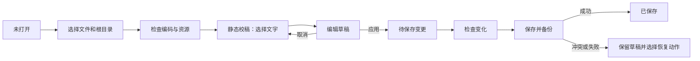

# 产品与交互设计

状态：交互规格，尚无已选定的视觉稿或已实现 UI。视觉方案在 HAE-007 中确定，不把线框说明当作界面验收。

前端方案整理、选定稿实现、组件、样式与交互修改由 Kimi 最新正式可用模型负责，当前核对基线为 Kimi K3（`kimi-code/k3`）。模型核对与交接规则见 [AI 开发流程](AI_WORKFLOW.md)；主代理负责独立复核和集成，维护者负责选稿与真实体验验收。

## 1. 体验目标

用户首先看到自己的 HTML。编辑器只在需要时解释“这段可改吗、改了什么、是否已经写入文件、遇到问题如何继续”。页面内容和原始排版是工作主体；源码定位、权限与日志放在按需打开的详情中。

默认简体中文；文案集中管理，键盘符号遵循当前平台。MVP 保留英文 README，不要求完整双语 UI 同时交付。

### 信息架构

| 区域 | 常驻内容 | 行为 |
| --- | --- | --- |
| 顶部 | 文件名、打开、模式、撤销/重做、变更数、保存 | 保存按钮始终明确；窗口标题用未保存标志 |
| 中央预览 | 原页面与选择高亮 | 浏览滚动不被截断；不覆盖整页 contenteditable |
| 右侧校稿栏 | 选中文字、纯文本输入、应用/取消、只读原因 | MVP 的可信输入区域，双击页面文字可直接聚焦 |
| 变更面板 | 修改列表、原文/新文、按需源码 Diff | 点击变更可定位，删除一条表示撤销该条草稿 |
| 底部状态 | 已保存/未保存/保存中、资源诊断入口 | 错误有文本和动作，不能仅改变颜色 |

目录导航按需展开，不先做文件管理器；当前一次只有一个可编辑入口。一个常用操作不应要求用户同时理解 DOM 树和源码。

### 视觉设计任务

在 UI 实施前，用同一个真实任务和同一份自制报告展示三种视觉方案：预览优先、校稿侧栏优先、变更复核优先。由维护者选择一个，再确定颜色、间距、字号、焦点样式和组件。设计稿至少包含正常编辑、只读提示、未保存、冲突和窄窗口状态。

视觉方案选择只约束 UI 实施，不阻止先验证独立核心算法和编写计划。采用 Product Design 进行后续界面制作时遵循其选稿与视觉 QA 流程。

## 2. 主流程

示例验收：打开“年度报告.html”，将标题年份修改为 2026，再改三处表格文字；取消一次未应用输入；查看四条实际变更；保存；独立浏览器重新打开；撤销其中一条并再次保存。用户应始终知道哪些输入已成为草稿，哪些变更已写到磁盘。

## 3. 浏览、选择与编辑合同

| 操作或条件 | 必须发生的行为 | 不允许的副作用 |
| --- | --- | --- |
| 首次打开 | 默认静态校稿，显示资源情况和脚本状态 | 不执行页面脚本、不自动保存 |
| 交互预览 | 可运行离线允许的本地脚本，文字编辑入口关闭 | 不把 JS 生成内容写回源码 |
| 静态校稿悬停 | 只对可定位 Text 片段显示精确高亮 | 不把父元素所有子节点当成一个字段 |
| 单击文字 | 选中并展示原文，显示可编辑或只读原因 | 不立即进入全页编辑、不开页面链接 |
| 双击可编辑文字或选中后 Enter | 聚焦右侧纯文本输入并定位光标 | 不依赖有风险的原生视图覆盖方案 |
| 应用草稿 | 校验选择版本，创建一个撤销操作组，更新预览 | 不写入 HTML 文件 |
| 取消/Escape | 放弃当前未应用输入，恢复该节点已有草稿或原文 | 源 HTML 零写入，不新增历史记录 |
| 失焦 | 保留输入，显示“尚未应用”，等待应用或取消 | 不悄悄提交或清空 |
| 编辑时点击另一段、切换模式/文件 | 询问应用、放弃或继续编辑 | 不把输入应用给新目标 |
| 输入与当前草稿相同 | 应用后不新增冗余历史；若恢复保存点则移除净变更 | 不把无变化标记为脏 |
| 空文本 | 允许清空受支持 Text 内容，并保持内存节点身份 | 不删除元素，不改变子结构 |
| 跨多个 Text 节点选区 | 告知首版需逐段修改，可选择其中一个片段 | 不合并 strong/span 等子元素 |
| 缩放、滚动、DPI 或侧栏改变 | 重算高亮矩形，无法定位时清除高亮 | 不让悬浮控件漂移到错误文字 |

首版输入在可信侧栏内，所选文字在页面上实时展示已应用草稿。原位浮层编辑可在 WebContentsView 的层级、焦点和 IME 验证通过后另行加入；并非 MVP 前提。

## 4. 中文输入、粘贴与键盘

- `compositionstart` 到 `compositionend` 期间不应用、不切换目标、不响应应用级 Enter/Escape/Ctrl+S。Escape 首先交给输入法；组合结束后再响应明确的新按键，不能重放旧保存指令。
- Enter 在多行输入框插入文本换行；Ctrl+Enter / Cmd+Enter 应用草稿。输入中的 Tab 按焦点顺序移动，不插入不可见字符。
- 粘贴只接收纯文本；`<script>`、`&` 等作为文字编码，不能成为 HTML。HTML 富文本粘贴不保留样式。
- 普通 HTML 会折叠换行与空格。输入旁说明“换行显示取决于原页面样式”；不自动插入 ` ` 或修改 white-space。`pre` 内有效 Text 节点按原样展示换行。
- 禁止 NUL、未配对代理项及超长输入，给出具体原因。Emoji 和正常组合字符不得按 UTF-16 半字符截断。
- 输入框内 Ctrl+Z / Cmd+Z 交给本地输入撤销；离开未应用输入后，应用级撤销才操作已应用草稿。菜单区分“撤销输入”和“撤销修改”。

| 动作 | Windows | macOS | 约束 |
| --- | --- | --- | --- |
| 打开 | Ctrl+O | Cmd+O | 先保护当前输入与草稿 |
| 保存 | Ctrl+S | Cmd+S | 若有未应用输入则明确提供“应用并保存”；IME 期间不触发 |
| 另存为 | Ctrl+Shift+S | Cmd+Shift+S | 不覆盖原文件，保留路径风险提示 |
| 撤销 | Ctrl+Z | Cmd+Z | 尊重输入框焦点与历史边界 |
| 重做 | Ctrl+Y / Ctrl+Shift+Z | Cmd+Shift+Z | 新修改清除重做分支 |
| 应用文字 | Ctrl+Enter | Cmd+Enter | 一次输入形成一个操作组 |
| 取消输入/退出选择 | Escape | Escape | 输入法优先，逐层退出 |

## 5. 保存、冲突与恢复

### 保存状态

`已保存` 只在写入结果回读校验成功后显示。`保存中` 期间冻结本次变更、禁用重复保存和新编辑；窗口可以滚动，关闭操作等待明确结果。没有写盘结果时不能显示成功。

保存默认不整页刷新，以保留滚动和校对位置；它更新源码基线与节点映射。交互预览需要重新载入时，提示动态运行状态会重置。保存后恢复选中片段的逻辑位置，若无法重新定位则清空选择。

| 情况 | 用户文案示例 | 可用动作 |
| --- | --- | --- |
| 目标来自脚本 | “这段内容由脚本生成，当前不能写回 HTML。” | 保持预览、查看支持范围 |
| 定位失效 | “页面内容已变化，请重新选择这段文字。” | 重新选择，保留未应用输入供复制 |
| 外部修改 | “文件已被其他程序修改，本次尚未覆盖。” | 另存草稿、重新加载、取消 |
| 备份失败 | “无法创建备份，原文件尚未修改。” | 重试、另存为、查看位置 |
| 权限或磁盘失败 | “保存失败，修改仍保留在这里。” | 重试、另存为、查看错误详情 |
| 写入结果不确定 | “需要先检查文件状态，暂时无法确认是否保存。” | 校验磁盘、恢复向导；禁用盲目重试 |
| 被阻断外部资源 | “有 3 个外部资源未加载，页面效果可能不完整。” | 查看资源列表，不自动联网 |
| 字符编码不支持 | “此文件不是可安全修改的 UTF-8，已只读打开。” | 查看原因、选择其他文件 |

“重新加载”先说明会放弃哪些草稿，必须由用户选择；另存冲突草稿使用打开时的原始基线加本次变更，明确可能不包含其他程序的最新修改，不能冒称已合并。

恢复备份与恢复草稿分开：备份是保存前的完整源文件；草稿是尚未写入的编辑意图。恢复覆盖当前文件时再次检查当前内容，采用与普通保存相同的备份与事务流程。

## 6. 关闭、退出与崩溃

- 干净状态直接关闭。
- 有未应用输入或未保存变更时显示“保存并关闭 / 放弃修改 / 取消”。输入法组合未结束时先回到输入，不进行关闭。
- 保存失败留在原窗口；不能因为已点击关闭而销毁草稿。
- 正在保存时禁止取消到一半或并发退出；完成后按结果继续关闭或保留窗口。
- 崩溃重启展示可恢复草稿的文件名、保存时间和基线状态；只有 hash 与文件身份匹配时才允许用户恢复，默认不自动写盘。
- 每次应用文字后异步持久化恢复记录；显示最后持久化状态。正在输入但未应用的字符属于尽力恢复范围，不能承诺掉电零丢失。

## 7. 尺寸、可访问性和响应限制

桌面窗口最小候选尺寸 960×640；主验证尺寸 1280×800、1440×900、1920×1080。窄窗口让变更面板切换为抽屉，优先保留预览与当前输入，工具栏次要动作收进菜单。这里只约束编辑器窗口，不改写 HTML 的响应式规则。

需实测 Windows 100%/125%/150%/200% DPI、macOS Retina、页面缩放和系统文字放大。高亮不截获滚轮；选择模式的单击与页面原有拖拽/链接冲突时由模式决定，不能同时执行。

所有操作可键盘访问；焦点回到触发位置；对话框有名称与焦点约束；保存结果采用可访问状态播报。只读原因有文字，焦点与选中不只靠颜色。至少人工检查 Windows Narrator 与 macOS VoiceOver 的核心路径。

## 8. 设计验收产物

HAE-007 交付选定视觉稿、组件和状态清单；HAE-009/HAE-012 交付主流程及错误流程录像/截图；HAE-014 交付 Mac 相同流程记录。截图需来自实际 UI，不能用设计稿代替功能证明。人工验收记录必须标记未测项。
